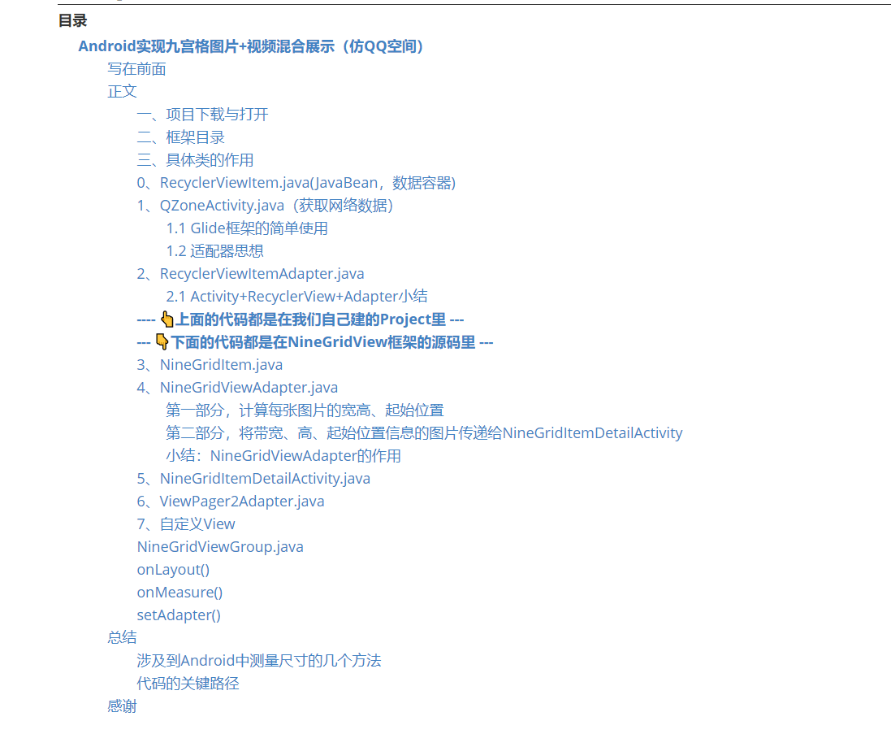
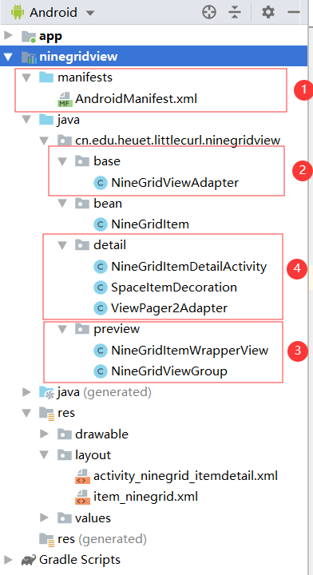

# **Android**实现九宫格图片+视频混合展示（仿QQ空间）

[TOC]



## 写在前面

**提示：以下图片或视频采用的都是Github相对路径，若有加载不成功的，请尝试刷新网页重新加载。**

**如果刷新还不行就把该仓库下载到本地，用markdown编辑器打开查看**

**实现效果：**[演示视频](https://www.bilibili.com/video/av76318011/)   👈 托管到哔哩哔哩了！

**演示截图：**


**本文源码：[[我的Github地址]](https://github.com/littlecurl/NineGridView)** 欢迎star！ 

**本文思路：**

​	**先**介绍一下框架的由来，**再**详细分析框架中每一部分的作用，**中间**会穿插一些知识点的详细讲解（比如适配器模式，属性动画等等），**最后**做个总结与感谢。

​	不过有三位必须放到文章一开始就进行感谢，不能放到最后

第一位前辈：本文源代码是在**廖子尧**前辈做的工作基础上进行改进的：

[廖子尧的Github](https://github.com/jeasonlzy/NineGridView)

第二位前辈：而廖子尧又是参考**laobie**的代码进行改进的，故而也得感谢前前辈：

[laobie的Github](https://github.com/laobie/NineGridImageView)

​	所以这个框架的历史就是下面这个样子：

　　**laobie **首造轮子 

　　　　===>  **廖子尧** 优化轮子 

　　　　　　===>  **Littlecurl（我）** 改造轮子  

　　　　　　　　===> ------ 接下来的精彩由**你**书写，期待你的加入...... ------

第三位前辈：**Shuyu Guo**，一位Github上的超级大佬。按说我们一个仓库有几百个star已经非常了不得了，这位大佬的仓库star动辄就上万了，顶礼膜拜！

[Shuyu Guo的Github](https://github.com/CarGuo)


闲话不多扯，直接进入正文


## 正文

### 一、项目下载与打开

实现下面点击展开功能的HTML源码

```html
<pre>
    <details>
    	<summary>👈点击展开 | 这些内容可以略过，故而折叠起来了</summary>
    	在这里写具体折叠的内容
    </details>
</pre>
```

<pre>
    <details>
    	<summary>👈点击展开 | 这些内容可以略过，故而折叠起来了</summary>
首先我们从Github上clone或者直接下载下来前辈的源码，用AS打开，
很多Android项目由于历史版本不兼容原因，下载下来直接打开后Gradle会报错，
Gradle在这个时候仿佛在上演一段八仙过海，Bug们都各显神通，施展浑身的招数。
不过，如果你见得多了，其实也就是那几种情况。
说一个最最常见的吧：AS转半天，最后报错timeout，下载超时
<b>分析如下</b>
通常和两个文件有关：
一是位于Project下的build.gradle中配置的com.android.tools.build版本与本地的不一致，
而且同样在这个文件中配置的jar包下载地址不行，解决办法往下看👇；
二是gradle-wrapper.properties里面配置的distributionUrl版本不行，解决办法往下看👇。
<b>解决办法</b>：
<b>第一步</b>：新建一个空项目，看看自己本地能跑起来的配置是哪个版本的
我们可以在新建的空项目中点击File ==》 Project Struct... ，也可以按快捷键Ctrl+Shift+Alt+S，如下图所示

然后记住这个项目的两个版本号，如下图所示
（这两个版本号就分别对应我上面说的那个com.android.tools.build版本与gradle-wrapper.properties里的distributionUrl版本）

将对应的版本号，以同样的操作配到你刚刚下载下来的，报错的项目中，Apply后OK
<b>第二步</b>，在Project下的build.gradle中配上常用的地址，防止因为<b>天朝墙</b>的原因，造成一些网络问题，导致一些依赖下载失败，
具体配置的地方如下，上下两个地方都需要配置

<code>
// 添加阿里云 maven 地址
maven { url 'http://maven.aliyun.com/nexus/content/groups/public/' }
maven { url 'http://maven.aliyun.com/nexus/content/repositories/jcenter' }
google()
jcenter()
maven { url "https://jitpack.io" }
mavenCentral()
jcenter{url "http://jcenter.bintray.com/"}
</code>
别忘了点右上方的Sync进行同步
还有可能会出现其他情况，那就具体而定了，多用搜索引擎搜一搜解决办法。
</details>
</pre>

### 二、框架目录

<pre>
<details>
<summary>👈点击展开 | 这些内容也可以略过，故而折叠起来了</summary>

从全局看，总共有三大块内容。
第一块是需要我们自己写的；
第二块我整合三位前辈的代码产出的一个框架；
第三块是Gradle，虽然有时候很难用，但是Google亲儿子，不用它也没别的了。
<h4>第一块代码的目录</h4>

重点关注图上标注的四点
①，manifests中的配置不用说就很重要。
因为涉及到网络加载，我们需要请求网络，所以要加上网络请求权限。
另外，Android9.0系统默认不允许访问http网络，所以我们还得单独配置一下。
在manifests中还配置了package的值，代表包名。这里的配置就是我们经常见的R资源文件的引用。
最后一点，每个需要加载的Activity和Application都需要来这里配置一下。
包名解释：
<code>
package="cn.edu.heuet.littlecurl"
www.heuet.edu.cn是我们学校的官网地址，littlecurl（小卷毛）是我们班女生给我起的外号，要知道，起个名字就很难了，起个外国名字更是难上加难，所以干脆就用它来当包名了。
</code>
②，App和LauncherActivity。
App继承自Application。一般Application的作用就是在App启动的时候，加载那些只需要加载一次的东西，比如：图片加载器。该类需要在AndroidManifest.xml文件中进行配置，android:name=".qzone.App"
LauncherActivity就是我们在Manifest文件中配置的启动类，所有的界面都从这里作为入口开始。
③，从LauncherActivity跳转到QZoneActivity，从类名可以看出，模仿的是QQ空间。
④，因为QZoneActivity整体用的是RecyclerView，所以需要一个适配器来绑定数据。
<h4>第二块代码的目录</h4>

主要关注下面这四大部分
①，manifest同上。
②，base包下有一个适配器，这个适配器是整个NineGridView框架对外暴露的入口。如果想仅仅使用九宫格这个框架，会用这个适配器就行了，其他的都可以不用管。
③，preview包下的内容就是呈现九宫格预览图的相关内容。所谓预览图就是九个小图片。
④，detail包下的内容就是我们点击九宫格的其中一个之后，如果是视频就加载视频播放器，否则加载大图。
<h4>第三块代码的目录</h4>

<div style="color:#F00">
<b>红框框，以 .gradle 结尾的文件。</b>
</div>
最上面是三个同名 build.gradle 也不知道gradle的开发者是咋想的，就不能叫成ProjectBuild.gradle和ModuleBuild.gradle吗？
好了，不抱怨了。
三个文件从上到下依次是一个项目级别的，两个模块级别的。
其中，我们的项目名称叫NineGridView-master,我们自己写的模块叫app，
引用的九宫格模块叫ninegridview，我这个输入法对这个英文名好像有什么自己的想法👇 : )

一般我们会在Project级别的build.gradle里面配置依赖的地址，而具体的依赖配置到具体的Module的build.gradle中。
下面还有一个settings.gradle,这里面是模块引用配置，一般都是AS自动帮我们生成，维护的。
<div style="color:#FF0">
<b>黄框框，以 .properties 结尾的文件。</b>
</div>
最上面那个，从后面的括号中我们能看出来，Global Properties，
说明他是一种全局的属性配置文件，里面配的是JVM最大堆的大小，一般我们也不用管。
在它下面的gradle-wrapper.properties文件我们已经在<b>项目下载与打开</b>那里见过了，
里面最重要的一句如下：
<code>
distributionUrl=https\://services.gradle.org/distributions/gradle-5.4.1-all.zip
</code>
再往下有一个Project级别的properties，这里我们也可以自定义jvm的最大堆等信息，
当然，现在里面就两句
<code>
android.useAndroidX=true
android.enableJetifier=true
</code>
如果想使用Androidx，这两句一句也不能少。
（2018年是Android十周年，Android包命名一直很乱，干脆在这十周年之际，
推出了Androidx（像不像iPhoneX），来统一依赖的名字，长痛不如短痛！）。
最下面的一个properties指明了我们本地SDK的安装目录。 
<div style="color:#3299cc">
<b>蓝框框，以pro结尾的文件。</b>
</div>
里面啥也没有，我也不知道有啥用 ：）
PS：色光的三原色是：红、黄、蓝；颜色的三原色是：品红，黄，青。
</details>
</pre>

### 三、具体类的作用

### 0、RecyclerViewItem.java(JavaBean，数据容器)

​		一个item就是一条控件动态，下图展示了两条动态：


​		RecyclerViewItem这个类就是用于接收后台数据的JavaBean，注意，其中有一个`ArrayList<MyMedia>`，这里的MyMedia.java是给九宫格适配器传递的数据。因为其他数据只是单纯的UI控件对数据进行绑定，而九宫格中的图片是可以点击查看大图或视频详情的，既需要**图片**地址又需要**视频**地址，概括一下就是**媒体**数据，本来应该叫Media，但是Android的SDK中已经存这个类名，所以就叫成了MyMedia，另外因为需要多条数据（九宫格嘛，肯定多条数据），所以就是`ArrayList<MyMedia>`，而MyMedia.java的内容也非常简单

```java
public class MyMedia implements Serializable {
    private String imageUrl;
    private String videoUrl;

    // 以下省略构造方法和Getter、Setter
}
```

​		这样我想你就能理解RecyclerViewItem.java中的内容了

```java
public class RecyclerViewItem implements Serializable {
    private String content;　　　　　　　　　　　　// 评论内容
    private String createTime;　　　　　　　　　　// 评论时间
    private String channelId;　　　　　　　　　　// 频道id（我也不知道这是啥）
    private String nickName;　　　　　　　　　　　// 评论人昵称
    private Location location;　　　　　　　　　　// 评论人位置（经纬度）
    private String headImageUrl;　　　　　　　　　// 头像url
    private ArrayList<MyMedia>  mediaList;　　　// 九宫格数据（图片和视频）

　　// 以下省略构造方法和Getter、Setter
}
```

​		其实软件工程规范的开发流程就是这样的，先有设计图，然后再针对设计图进行设计数据结构。

什么时候你能达到看着设计图就能想到对应的JavaBean结构，那么我想，一般的App开发任务你就可以胜任了。

JavaBean就相当于一个接收数据的容器，现在容器有了，我们需要去获取数据了。

### 1、QZoneActivity.java（获取网络数据）

​		Activity和Fragment是Android中两类UI控制器，MVC架构中的C层，MVP架构中的P层。

​		获取后台数据的方法：Okhttp请求网络 + Json解析，详情不是本次的重点，我就不多说了，你都会了。 ：)

​		因为我没有后台，所以数据是我手动设置。

<pre>
    <details>
    	<summary>👈点击展开 | 这些内容可以略过，故而折叠起来了</summary>
// 自定义的测试数据（假装这是网络请求并解析后的数据）
private void loadMyTestDate(){
    // 先构造MyMedia
    String imgUrl1 = "http://i2.tiimg.com/702441/6e3d61b352409f34.png";
    String imgUrl2 = "http://i2.tiimg.com/702441/ca8092e87a2f2b30.jpg";
    String imgUrl3 = "http://i2.tiimg.com/702441/081b443af609c94c.png";
    String videoUrl = "http://jzvd.nathen.cn/c6e3dc12a1154626b3476d9bf3bd7266/6b56c5f0dc31428083757a45764763b0-5287d2089db37e62345123a1be272f8b.mp4";
    MyMedia myMedia1 = new MyMedia(imgUrl1,videoUrl);
    MyMedia myMedia2 = new MyMedia(imgUrl2);
    MyMedia myMedia3 = new MyMedia(imgUrl3);
    // 再构造mediaList
    ArrayList<MyMedia> mediaList = new ArrayList<>();
    for (int i = 0; i < 3; i++) { // 加入9张图片
        mediaList.add(myMedia1);
        mediaList.add(myMedia2);
        mediaList.add(myMedia3);
    }
    Location location = new Location();
    location.setAddress("Test Address");
     // 最后构造RecyclerViewItem
    final RecyclerViewItem RecyclerViewItem1 = new RecyclerViewItem(mediaList, "河北经贸大学...", 
    "2019-11-02","10080", "自强社", location, imgUrl1);
    final RecyclerViewItem RecyclerViewItem2 = new RecyclerViewItem(mediaList, "河北经贸大学...", 
    "2019-11-02","10080", "信息技术学院", location, imgUrl2);
    final RecyclerViewItem RecyclerViewItem3 = new RecyclerViewItem(mediaList, "河北经贸大学...", 
    "2019-11-02","10080", "雷雨话剧社", location, imgUrl3);
    RecyclerViewItemList.add(RecyclerViewItem1);
    RecyclerViewItemList.add(RecyclerViewItem2);
    RecyclerViewItemList.add(RecyclerViewItem3);
}
    </details>
</pre>

通过QZoneActivity我们可以拿到所有需要展示的数据，但这仅仅是数据，我们需要把数据和具体的UI控件进行绑定。

如果说是单纯的一个ImageView进行数据绑定，那么完全可以就在 QZoneActivity 中进行，比如我们通过Glide框架，很方便的**一行代码**就能绑定图片url到ImageView中

#### 1.1 Glide框架的简单使用

```java
// 使用前记得先添加dependency
Context context = getApplicationContext();
String url = "图片url";
ImageView imageView = findViewById(R.id.iv);

Glide.with(context).load(url).into(imageView); // 一行代码指的是这一行
```

​		但是，我们要呈现的界面可不仅仅只有一张图片。

​		我们要呈现的是一个可以滑动的RecyclerView或者ListView，因为这两个控件一般需要把很多UI控件和很多数据进行绑定，如果全都写在一个类里面，一是类显得过于臃肿，不好理解；二是代码太密集，不便快速定位问题；三是代码耦合度太高，不符合优秀的编程思想（这也是产生前面两个问题的终极原因）。

​		所以，我们需要把数据获取和数据绑定进行分离，这就用到了适配器模式。

#### 1.2 适配器思想

原先代码逻辑是：Activity从XML布局文件中获取UI控件对象，同时Activity也从网络上获取数据，然后在Activity中将二者进行绑定。


引入适配器之后：Activity只负责获取网络数据，拿到之后传递给适配器。适配器再从XML布局文件中拿到UI控件，将二者进行绑定。通过引入适配器，数据获取与数据绑定就解耦合了。


​		原先的Activity既需要获取数据，又需要绑定数据。适配器的出现帮他分离了绑定数据的代码，让Activity只做好获取数据一件事就行，拿到数据之后，传给适配器就行。这就是所谓的解耦合。

​		这样更适合互联网公司多人协同开发，一些人只管写布局文件，一些人只管写适配器，一些人只管写Activity。如果配合得当，效率肯定是比原先的快，这样就能更快的上线App产品，更快的抢占市场，更快的获取利润，更快的成为人生赢家，更快的迎娶白富美，更快的为社会主义现代化建设做贡献，更快的实现共产主义，更快的......

​		（喂ヽ(●-`Д´-)ノ，醒醒，醒醒......大郎，该喝药了！） 

### 2、RecyclerViewItemAdapter.java

​		刚才我们说的是QZoneActivity.java中的代码，它获取到网络数据之后（其实是我手写的测试数据），就将数据以List的方式传递给了适配器，这个适配器就是RecyclerViewItemAdapter。先假设适配器已经完成了数据绑定的工作（不去看里面具体的代码），一旦数据绑定完成，我们就可以将适配器设置给RecyclerView / ListView对象让它去进行渲染展示，这就是Android使用RecyclerView / ListView进行数据展示的整体逻辑。

#### 2.1 Activity+RecyclerView+Adapter小结

​		1. **Activity**中获取网络数据

​		2. **Activity**中将网络数据传递给适配器*Adapter*

​		3. *Adapter*中获取UI控件

​		4. *Adapter*中将数据绑定到对应的UI控件上

​		5. **Activity**中获取RecyclerView / ListView对象并设置写好的适配器

Adapter中的代码细节就不过多讲了，天下所有的适配器代码逻辑大都一个样子，如果不会写就去网上找一个来模仿，也可以看我下面给出的代码，模仿一遍不行写三遍，多写几遍就会了。

<pre>
    <details>
    	<summary>👈点击展开 | 这些内容可以略过，故而折叠起来了</summary>
public class RecyclerVidewAdapter extends RecyclerView.Adapter<RecyclerVidewAdapter.ViewHolder> {
    private Context context;
    private List<RecyclerViewItem> recyclerViewItemList;
    public RecyclerVidewAdapter() {
    }
    /**
     * 1、接收外部传来的数据
     */
    public RecyclerVidewAdapter(Context context, List<RecyclerViewItem> recyclerViewItemList) {
        this.context = context;
        this.recyclerViewItemList = recyclerViewItemList;
    }
    /**
     * 2、填充布局
     */
    @NonNull
    @Override
    public RecyclerVidewAdapter.ViewHolder onCreateViewHolder(@NonNull ViewGroup parent, int viewType) {
        View view = LayoutInflater.from(context).inflate(R.layout.item_recyclerview, parent, false);
        return new ViewHolder(view);
    }
    /**
     * 3、声明并初始化布局中的控件
     */
    public class ViewHolder extends RecyclerView.ViewHolder {
        private final ImageView avatar;
        private final TextView tv_username;
        private final TextView tv_createTime;
        private final TextView tv_content;
        private final NineGridViewGroup nineGridViewGroup;
        private final TextView tv_location;
        private final ImageView iv_detail_triangle;
        private final ImageView iv_eye;
        private final ImageView iv_share;
        public ViewHolder(@NonNull View itemView) {
            super(itemView);
            // 头像
            avatar = itemView.findViewById(R.id.avatar);
            // 用户名
            tv_username = itemView.findViewById(R.id.tv_username);
            // 创建时间
            tv_createTime = itemView.findViewById(R.id.tv_createTime);
            // 内容
            tv_content = itemView.findViewById(R.id.tv_content);
            // 图片九宫格控件
            nineGridViewGroup = itemView.findViewById(R.id.nineGrid);
            // 位置
            tv_location = itemView.findViewById(R.id.tv_location);
            // 位置详情三角小图标
            iv_detail_triangle = itemView.findViewById(R.id.iv_detail_triangle);
            // 围观眼睛小图标
            iv_eye = itemView.findViewById(R.id.iv_eye);
            // 分享小图标
            iv_share = itemView.findViewById(R.id.iv_share);
        }
    }
    /**
     * 4、控件上绑定数据
     */
    @Override
    public void onBindViewHolder(@NonNull RecyclerVidewAdapter.ViewHolder holder, int position) {
        // 获取对应的数据
        RecyclerViewItem recyclerViewItem = recyclerViewItemList.get(position);
        // 往控件上绑定数据
        setImage(context, holder.avatar, recyclerViewItem.getHeadImageUrl());
        holder.tv_username.setText(recyclerViewItem.getNickName());
        holder.tv_createTime.setText(recyclerViewItem.getCreateTime());
        holder.tv_content.setText(recyclerViewItem.getContent());
        holder.tv_location.setText(recyclerViewItem.getLocation().getAddress());
        holder.iv_detail_triangle.setOnClickListener(new View.OnClickListener() {
            @Override
            public void onClick(View view) {
                Toast.makeText(context, "位置详情图标点击事件还未开发", Toast.LENGTH_SHORT).show();
            }
        });
        holder.iv_eye.setOnClickListener(new View.OnClickListener() {
            @Override
            public void onClick(View view) {
                Toast.makeText(context, "围观图标点击事件还未开发", Toast.LENGTH_SHORT).show();
            }
        });
        holder.iv_share.setOnClickListener(new View.OnClickListener() {
            @Override
            public void onClick(View view) {
                Toast.makeText(context, "分享图标点击事件还未开发", Toast.LENGTH_SHORT).show();
            }
        });
        // 为满足九宫格适配器数据要求，需要构造对应的List
        ArrayList<MyMedia> mediaList = recyclerViewItem.getMediaList();
        ArrayList<NineGridItem> nineGridItemList = new ArrayList<>();
        for (MyMedia myMedia : mediaList) {
            String thumbnailUrl = myMedia.getImageUrl();
            String bigImageUrl = thumbnailUrl;
            String videoUrl = myMedia.getVideoUrl();
            nineGridItemList.add(new NineGridItem(thumbnailUrl, bigImageUrl, videoUrl));
        }
        NineGridViewAdapter nineGridViewAdapter = new NineGridViewAdapter(nineGridItemList);
        holder.nineGridViewGroup.setAdapter(nineGridViewAdapter);
    }
    // 5、返回Item个数
    @Override
    public int getItemCount() {
        return recyclerViewItemList.size();
    }
    // 通过图片的Url给ImageView控件设置对应的图片
    private void setImage(Context context, ImageView imageView, String url) {
        Glide.with(context)
                .load(url)
                .placeholder(R.drawable.ic_default_color)
                .error(R.drawable.ic_default_color)
                .diskCacheStrategy(DiskCacheStrategy.ALL)
                .into(imageView);
    }
}
    </details>
</pre>

在上面折叠的代码中，我有标记好方法的顺序，虽然一个类中，方法的顺序和功能的实现没有联系。但是我推荐你像我一样，把方法都按照这个顺序来放置，因为这样更符合逻辑：

1、适配器的构造方法，接收外部传来的数据

2、填充布局，onCreateViewHolder()

3、声明并初始化布局中的控件，ViewHolder类

4、控件上绑定数据，onBindViewHolder()

5、返回Item的个数，getItemCount()


### **---- 👆上面的代码都是在我们自己建的Project里 ---**

### **--- 👇下面的代码都是在NineGridView框架的源码里 ---**


### 3、NineGridItem.java

这个类是九宫格适配器接收数据的格式，不知道你发现规律了没有，我每次都是先从JavaBean开始说起。

这个JavaBean原先叫ImageInfo，因为既要承载 Image 又要承载 Video，将来还有可能承载 Voice概括一下就是媒体信息Media，又因为它承载的是九宫格中的一格内容，属于一个item，所以就叫成了 NineGridItem

代码也很简单

```java
public class NineGridItem implements Serializable {
    public String thumbnailUrl;
    public String bigImageUrl;
    public int imageViewHeight;
    public int imageViewWidth;
    public int imageViewX;
    public int imageViewY;

    public String videoUrl;

    // 省略构造方法和Setter、Getter
}
```


### 4、NineGridViewAdapter.java

这个类对外暴露

外部使用方式就是传过来一个Context，一个NineGridItem泛型的List。

再回头看这个类的主要代码，就是一个重写响应Click事件的方法，如果以概括的眼光看这个方法的话，其实只有两部分代码

如下：

```java
@Override
public void onNineGridItemClick(Context context, NineGridViewGroup nineGridViewGroup,
                             int index, List<NineGridItem> NineGridItemList) {
    // 第一部分，计算每张图片的宽高、起始位置
    for (int i = 0; i < NineGridItemList.size(); i++) {
        NineGridItem NineGridItem = NineGridItemList.get(i);
        View view;
        if (i < nineGridViewGroup.getMaxSize()) {
            view = nineGridViewGroup.getChildAt(i);
        } else {
            view = nineGridViewGroup.getChildAt(nineGridViewGroup.getMaxSize() - 1);
        }
        NineGridItem.imageViewWidth = view.getWidth();
        NineGridItem.imageViewHeight = view.getHeight();
        int[] points = new int[2];
        view.getLocationInWindow(points);
        NineGridItem.imageViewX = points[0];
        NineGridItem.imageViewY = points[1];
    }
	// 第二部分，将带宽、高、起始位置信息的图片传递给NineGridItemDetailActivity
    Intent intent = new Intent(context, NineGridItemDetailActivity.class);
    Bundle bundle = new Bundle();
    bundle.putSerializable(NineGridItemDetailActivity.MEDIA_INFO, (Serializable) NineGridItemList);
    bundle.putInt(NineGridItemDetailActivity.CURRENT_ITEM, index);
    intent.putExtras(bundle);
    context.startActivity(intent);
    ((Activity) context).overridePendingTransition(0, 0);
}
```

#### 第一部分，计算每张图片的宽高、起始位置

我们从后端获取到的只是图片的URL地址，并没有图片相关的宽、高。图片显示多宽多高是我们根据自定义的NineGridView来计算的。

因此，我们需要遍历一下传过来的NineGridItemList中的每个NineGridItem，给他设置一个宽、高、起始坐标点。

#### 第二部分，将带宽、高、起始位置信息的图片传递给NineGridItemDetailActivity

这里注意两点

① 传递自定义泛型的ListView时需要使用putSerializable()方法，而且ListView中的子类必须都实现序列化方法，即 implements Serializable，否则Intent在进行跳转的时候会报错。

② overridePendingTransition(0,0)的作用是去掉Activity切换之间的动画。

更多用法可以参考 简书  [姜康](https://www.jianshu.com/u/2c22c64b9aff) [《overridePendingTransition 的使用》](https://www.jianshu.com/p/c19e607f08aa)

#### 小结：NineGridViewAdapter的作用

① 提供整个框架对外暴露的接口

② 预处理外部传过来的数据，给每个图片设置固定的九宫格宽高

③ 如果现在还不能理解自定义View，没有关系，继续往下看

### 5、NineGridItemDetailActivity.java

在上面介绍NineGridViewAdapter的第二部分代码中，有一个Intent带着NineGridItemList跳转到了NineGridItemDetailActivity。

所以这个Activity的作用就是：接收NineGridViewAdapter传递过来的图片，准备进行图片详情呈现。

这里会产生疑问：九宫格预览图片在哪呈现的，怎么感觉连图片都没有呢就点击查看详情了？

要想解开这个疑惑，详情见<a href="#customView">自定义View</a>

话说回来图片详情呈现，我们用到了ViewPager2，这是Google公司在2019年新推出的控件，我用的这一版是1.0.0稳定版同时也是2019-11-30截止最新版。

官方说：如果可以的话，最好使用ViewPager2代替ViewPager，因为它简单，高效。

原先ViewPager的实现最经典的就是结合Fragment一起使用。现在ViewPager2可以不用实现Fragment，仅仅写一个RecyclerView的适配器，就可以了。

适配器的具体内容放到下一小节讲。这一节来看看关于ViewPager2的页面切换监听是如何实现的。

首先，我们需要在onCreate()方法中注册一个回调方法

```java
 viewPager2.registerOnPageChangeCallback(onPageChangeCallback);
```

为了防止onCreate()方法过于臃肿，把它的实现写到外面了

```java
ViewPager2.OnPageChangeCallback onPageChangeCallback = new ViewPager2.OnPageChangeCallback() {
        @Override
        public void onPageScrolled(int position, float positionOffset, int positionOffsetPixels) {
            super.onPageScrolled(position, positionOffset, positionOffsetPixels);
        }
        /**
         * 页面切换结束位置: position
         */
        @SuppressLint("StringFormatMatches")
        @Override
        public void onPageSelected(int position) {
            super.onPageSelected(position);
            // 记录位置变化
            lastItem = currentItem;
            currentItem = position;
            // 更新底部文字
            tv_pager.setText(String.format(getString(R.string.select), currentItem + 1, nineGridItemList.size()));
            // 大于0说明有播放
            if (GSYVideoManager.instance().getPlayPosition() >= 0) {
                //当前播放的位置
                int currentPlayingPosition = GSYVideoManager.instance().getPlayPosition();
                if (currentPlayingPosition != currentItem) {
                    GSYVideoManager.onPause();
                    if (!GSYVideoManager.isFullState((Activity) context)) {
                        GSYVideoManager.releaseAllVideos();
                        viewPager2Adapter.notifyDataSetChanged();
                    }
                }
            }
        }
        @Override
        public void onPageScrollStateChanged(int state) {
            super.onPageScrollStateChanged(state);
        }
    };
```

这里有三个方法被重写了

```java
public void onPageScrolled()
public void onPageSelected(int position)
public void onPageScrollStateChanged()    
```

我们只用到了中间这一个。这个方法带有一个参数position，它代表我们想要去的位置，也就是页面切换结束的位置。

所以，在切换之前，我们先把当前的位置记录一下。因为我们只能一页一页的切换，所以只需要把当前页面的位置+1就是下一页的序号了，然后更新底部文字。

接下来，我们要判断，如果有视频正在播放的话，看一下是不是当前位置正在播放视频。如果不是，就把正在播放的视频暂停，回收资源。

至于其他两个方法，这里没有用到（其实是我还没有掌握：）

### 6、ViewPager2Adapter.java

上面说到了谷歌官方2019年推出的新控件ViewPager2需要且仅仅需要一个RecyclerView的视频器就能实现页面切换。所以从这个适配器类的声明方式也可以看出来，其实他就是一个RecyclerView适配器

```java
public class ViewPager2Adapter extends RecyclerView.Adapter<ViewPager2Adapter.ViewHolder>
```

既然是RecyclerView的适配器，那么代码的写法就固定了，还是那五步

1、适配器的构造方法，接收外部传来的数据

2、填充布局，onCreateViewHolder()

3、声明并初始化布局中的控件，ViewHolder类

4、控件上绑定数据，onBindViewHolder()

5、返回Item的个数，getItemCount()

这里，我们重点关注一下第4步onBindViewHolder()

```java
@Override
public void onBindViewHolder(@NonNull ViewPager2Adapter.ViewHolder holder, int position) {
    // 存在视频地址
    if (existVideoUrl(nineGridItemList, position)) {
        holder.photoView.setVisibility(View.INVISIBLE);
        holder.gsyVideoPlayer.setVisibility(View.VISIBLE);
        holder.gsyVideoPlayer.setPlayTag(TAG);
        holder.gsyVideoPlayer.setUpLazy(
            nineGridItemList.get(position).getVideoUrl(),
            true,
            null,
            null,
            "");
        // 隐藏title
        holder.gsyVideoPlayer.getTitleTextView().setVisibility(View.GONE);
        // 隐藏返回键
        holder.gsyVideoPlayer.getBackButton().setVisibility(View.GONE);
        // 设置全屏按键功能
        holder.gsyVideoPlayer.getFullscreenButton().setOnClickListener(new View.OnClickListener() {
            @Override
            public void onClick(View v) {
                holder.gsyVideoPlayer.startWindowFullscreen(context, false, true);
            }
        });
        // 防止错位设置
        holder.gsyVideoPlayer.setPlayPosition(position);
        // 是否根据视频尺寸，自动选择竖屏全屏或者横屏全屏
        holder.gsyVideoPlayer.setAutoFullWithSize(true);
        // 音频焦点冲突时是否释放
        holder.gsyVideoPlayer.setReleaseWhenLossAudio(false);
        // 全屏动画
        holder.gsyVideoPlayer.setShowFullAnimation(true);
        // 小屏时不触摸滑动
        holder.gsyVideoPlayer.setIsTouchWiget(false);
    } else {
        holder.photoView.setVisibility(View.VISIBLE);
        holder.gsyVideoPlayer.setVisibility(View.INVISIBLE);

        showExcessPic(nineGridItemList.get(position), holder.photoView);
        NineGridViewGroup.getImageLoader().onDisplayImage(
            context,
            holder.photoView,
            nineGridItemList.get(position).bigImageUrl);
    }
}
```

核心就是一个if条件判断语句，如果我们接收到的数据中，当前Item存在视频地址，那么就去播放视频，否则去呈现图片的大图。至于视频播放的那部分代码，是我从GSYVideoPlayer的Github地址上Copy过来的。人家专门说到了如何在列表里使用。

### 7、<a name="customView">自定义View</a>

### NineGridViewGroup.java

其实整个框架的核心就是这个类。自定义View这里我也不是很熟练，就说说我的理解吧。

因为我们需要呈现一个九宫格，算是一组基本的控件，所以需要继承ViewGroup

```java
public class NineGridViewGroup extends ViewGroup
```

又因为ViewGroup是个抽象类，里面有个抽象方法onLayout()，根据Java规定，实现类必须实现抽象类中的抽象方法，所以我们这里必须去实现onLayout(),下面代码都是前辈写的，我们一起来欣赏一下。

### onLayout()

```java
@Override
protected void onLayout(boolean changed, int l, int t, int r, int b) {
    if (nineGridItemList == null) return;
    int childrenCount = nineGridItemList.size();
    for (int i = 0; i < childrenCount; i++) {
        ImageView childrenView = (ImageView) getChildAt(i);
        int rowNum = i / columnCount;
        int columnNum = i % columnCount;
        int left = (gridWidth + gridSpacing) * columnNum + getPaddingLeft();
        int top = (gridHeight + gridSpacing) * rowNum + getPaddingTop();
        int right = left + gridWidth;
        int bottom = top + gridHeight;
        childrenView.layout(left, top, right, bottom);
        if (mImageLoader != null) {
            mImageLoader.onDisplayImage(getContext(),
                                        childrenView,
                                        nineGridItemList.get(i).thumbnailUrl);
        }
    }
}
```

通过观察代码我们可以发现，onLayout()核心代码就是通过一个for循环，生成了多个ImageView，同时计算并规定了每个ImageView的上下左右的坐标位置。

这里，为了直观，我手画了一个草图，大家可以看着理解一下代码中各个参数的意思

需要注意一点就是代码中的rowNum和columNum都是从0开始算起的。

 

考虑到如果只有一张图片的话，不应该显示在九宫格的左上角，而是单独显示一张图片；只有两张或四张图片的话，应该两张图片占满宽度。

所以，我们必须重写一下onMeasure()方法，下面的代码也是前辈写的。我们晚辈需要做的就是，欣赏，学习，模仿。（适配2张和4张图片相关代码是我加上去的）

### onMeasure()

```java
@Override
protected void onMeasure(int widthMeasureSpec, int heightMeasureSpec) {
    super.onMeasure(widthMeasureSpec, heightMeasureSpec);
    // 获取总宽度,包含padding值
    int width = MeasureSpec.getSize(widthMeasureSpec);
    int height = 0;
    int totalWidth = width - getPaddingLeft() - getPaddingRight();
    int gridNum = nineGridItemList.size();
    if (nineGridItemList != null &&  gridNum > 0) {
        // 只有一张图片的情况
        if (gridNum == 1) {
            gridWidth = singleMediaSize > totalWidth ? totalWidth : singleMediaSize;
            gridHeight = (int) (gridWidth / singleImageRatio);
            //矫正图片显示区域大小，不允许超过最大显示范围
            if (gridHeight > singleMediaSize) {
                float ratio = singleMediaSize * 1.0f / gridHeight;
                gridWidth = (int) (gridWidth * ratio);
                gridHeight = singleMediaSize;
            }
        }
        // 有 2 张 或 4 张图片的情况
        else if (gridNum == 2 || gridNum == 4){
            gridWidth = singleMediaSize > totalWidth / 2 ? totalWidth/2 : singleMediaSize;
            gridHeight = (int) (gridWidth / singleImageRatio);
            //矫正图片显示区域大小，不允许超过最大显示范围
            if (gridHeight > singleMediaSize) {
                float ratio = singleMediaSize * 1.0f / gridHeight;
                gridWidth = (int) (gridWidth * ratio);
                gridHeight = singleMediaSize;
            }
        }
        // 有其他数量多张图片的情况
        else {
            // gridWidth = gridHeight = (totalWidth - gridSpacing * (columnCount - 1)) / columnCount;
            //这里无论是几张图片，宽高都按总宽度的 1/3
            gridHeight = (totalWidth - gridSpacing * 2) / 3;
            gridWidth = gridHeight;
        }
        width = gridWidth * columnCount + gridSpacing * (columnCount - 1) + getPaddingLeft() + getPaddingRight();
        height = gridHeight * rowCount + gridSpacing * (rowCount - 1) + getPaddingTop() + getPaddingBottom();
    }
    // 存储计算得到的ViewGroup的宽高
    setMeasuredDimension(width, height);
}
```

自定义View的最后一点，我们控件要想接收数据，需要写一个适配器来作为数据的入口，这样，别人在用我们自定义View的时候，就能像使用RecyclerView / ListView一样，写个适配器，设置给对应的控件。

### setAdapter()

```java
/**
     * 设置适配器
     * */
public void setAdapter(@NonNull NineGridViewAdapter adapter) {
    // 初始化mAdapter，此类的其他方法会用到
    mAdapter = adapter;
    List<NineGridItem> nineGridItemList = adapter.getNineGridItemList();

    if (nineGridItemList == null || nineGridItemList.isEmpty()) {
        this.setVisibility(GONE);
        return;
    } else {
        this.setVisibility(VISIBLE);
    }

    int gridCount = nineGridItemList.size();
    if (maxGridSize > 0 && gridCount > maxGridSize) {
        nineGridItemList = nineGridItemList.subList(0, maxGridSize);
        gridCount = nineGridItemList.size();   //再次获取图片数量
    }

    //默认是3列显示，行数根据图片的数量决定
    rowCount = gridCount / 3 + (gridCount % 3 == 0 ? 0 : 1);
    columnCount = 3;
    //grid模式下，显示4张使用2X2模式
    if (mode == MODE_GRID) {
        if (gridCount == 4) {
            rowCount = 2;
            columnCount = 2;
        }
    }

    // 保证View的复用，避免重复创建
    if (this.nineGridItemList == null) {
        for (int i = 0; i < gridCount; i++) {
            ImageView iv = getImageView(i);
            if (iv == null)
                return;
            addView(iv, generateDefaultLayoutParams());
        }
    } else {
        int oldViewCount = this.nineGridItemList.size();
        int newViewCount = gridCount;
        if (oldViewCount > newViewCount) {
            removeViews(newViewCount, oldViewCount - newViewCount);
        } else if (oldViewCount < newViewCount) {
            for (int i = oldViewCount; i < newViewCount; i++) {
                ImageView iv = getImageView(i);
                if (iv == null)
                    return;
                addView(iv, generateDefaultLayoutParams());
            }
        }
    }
    //修改最后一个条目，决定是否显示更多
    if (adapter.getNineGridItemList().size() > maxGridSize) {
        View child = getChildAt(maxGridSize - 1);
        if (child instanceof NineGridItemWrapperView) {
            NineGridItemWrapperView imageView = (NineGridItemWrapperView) child;
            imageView.setMoreNum(adapter.getNineGridItemList().size() - maxGridSize);
        }
    }
    this.nineGridItemList = nineGridItemList;
    // 请求重新布局
    requestLayout();
}
```

这种自定义View的适配器写起来都是毫无章法，不像官方的RecyclerViewAdapter和BaseAdapter那样，都规定好了第一步写啥，第二步写啥。

只能去记忆、积累了，或许写的多了就会了。

## 总结

### 涉及到Android中测量尺寸的几个方法

```java
// 测量图片在当前窗口的起始坐标（NineGridViewAdapter.java）
int[] points = new int[2];
nineGridViewItem.getLocationInWindow(points);
NineGridItem.imageViewX = points[0];
NineGridItem.imageViewY = points[1];
// 测量整个屏幕的宽、高(NineGridItemDetailActivity.java)
DisplayMetrics metric = new DisplayMetrics();
getWindowManager().getDefaultDisplay().getMetrics(metric);
screenWidth = metric.widthPixels;
screenHeight = metric.heightPixels;
// 获取自定义布局的总宽度,包含padding值(NineGridViewGroup.java)
int width = MeasureSpec.getSize(widthMeasureSpec);
```


### 代码的关键路径

俗话说：“能坐着就不站着，能躺着就不坐着”。哦，不对。应该是俗话说：“一图胜千言！”

接下来，有请翠花上酸~~上图片


洋洋洒洒写了8k+字，还有一些比如属性动画还没有写到。由于我还没有完全掌握，这里就先刨个坑吧，以后熟练了再来填坑。


## 感谢 

感谢以下前辈做出的贡献(排名不分先后)，晚辈只是踩在了巨人的肩膀上，换句话说，我只是抱了大佬的腿

<p  style="text-align:center;"> <br /><b>衷心感谢以下前辈们，致敬！</b></p>
...       
| 序号 | 来源   | 作者                                                         | 标题                                                         |
| ---- | ------ | ------------------------------------------------------------ | ------------------------------------------------------------ |
| 1    | Github | [廖子尧](https://github.com/jeasonlzy/NineGridView)          | [《NineGridView》](https://github.com/jeasonlzy/NineGridView) |
| 2    | Github | [laobie](https://github.com/laobie/NineGridImageView)        | [《NineGridView》](https://github.com/laobie/NineGridImageView) |
| 3    | CSDN   | [sm7890123](https://blog.csdn.net/sm7890123)                 | [《关于Android VideoView启动时闪屏的问题》](https://blog.csdn.net/sm7890123/article/details/80801732) |
| 4    | CSDN   | [王英豪]()                                                   | [《Android 带你彻底理解 Window 和 WindowManager》](https://blog.csdn.net/yhaolpz/article/details/68936932) |
| 5    | 简书   | [鸡汤程序员](https://www.jianshu.com/u/3f3c4485b55a)         | [《Android Studio 可以正常编译但是代码爆红解决方法》](https://www.jianshu.com/p/3fab5bb2ccd2) |
| 6    | 简书   | [SparkInLee](https://www.jianshu.com/u/c95e489136f6)         | [《Android Animator运行原理详解》](https://www.jianshu.com/p/ee7e3d79006d) |
| 7    | CSDN   | [小草的胖冬瓜](https://blog.csdn.net/Yoryky)                 | [《最新android sdk版本号和sdk的对应关系》](https://blog.csdn.net/Yoryky/article/details/78973690) |
| 8    | 简书   | [姜康](https://www.jianshu.com/u/2c22c64b9aff)               | [《overridePendingTransition 的使用》](https://www.jianshu.com/p/c19e607f08aa) |
| 9    | CSDN   | [卖火柴的小男孩2019](https://blog.csdn.net/u014644594)       | [《android 在自定义view中获取屏幕宽度,并设置自定义控件位置》](https://blog.csdn.net/u014644594/article/details/80526481) |
| 10   | 博客园 | [LeoBoy](https://www.cnblogs.com/LeoBoy/)                    | [《BigDecimal除法运算的一个坑》](https://www.cnblogs.com/LeoBoy/p/5897754.html) |
| 11   | 博客园 | [朝着希望前进](https://www.cnblogs.com/LiuDanK/)             | [《解决AndroidStudio 安卓模拟器安装在D盘问题》](https://www.cnblogs.com/LiuDanK/articles/10106473.html) |
| 12   | 博客园 | [弗兰克的猫](https://www.cnblogs.com/mfrank/category/1118474.html) | [《Java提高篇的若干文章》](https://www.cnblogs.com/mfrank/category/1118474.html) |
| 13   | CSDN   | [code丶forward](https://blog.csdn.net/xingpidong)            | [《Android视频播放之ViewPager+VideoView》](https://blog.csdn.net/xingpidong/article/details/52933185) |
| 14   | Github | [CarGuo](https://github.com/CarGuo)                          | [《GSYVideoPlayer》](https://github.com/CarGuo/GSYVideoPlayer) |
| 15   | 知乎   | [相机拿反了](https://www.zhihu.com/people/xin-hui-fei-xiang) | [《十种快速压缩gif的方法，一定要收藏》](https://zhuanlan.zhihu.com/p/28866581) |
| ...  | ...    | 还有很多大佬<br />没有记住名字                               | 很多很多优秀的文章，我没顾上搬到这里，在此一并表示感谢！     |


另外感谢一些工具、文档、资料网站

1. PC版QQ	  [Ctrl+Alt+A截长图工具]()
2. ProcessOn   [在线画流程图]()
3. 多吉搜索　　[号称要干掉百度的不追踪广告少的搜索引擎]()

还有一些Android学习站点推荐

1. [泡在网上的日子](http://www.jcodecraeer.com/)
2. [掘金](https://juejin.im/)
3. [Android官方开发者平台国内版](https://developer.android.google.cn/)

<p  style="text-align:center;"><b>再次感谢以上前辈们，致敬！</b><br /></p>
引用一位职业旅行家小鹏说过的话作为结尾吧：

“我希望每个人都有梦想，

希望每个梦想都很灿烂，

希望每个灿烂都能实现。”