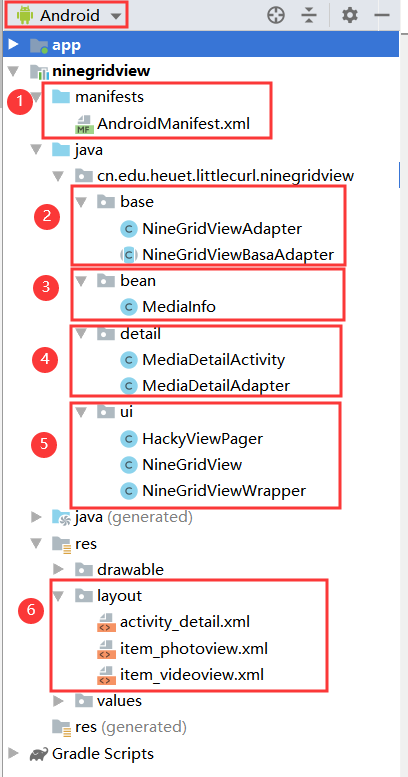

Android实现九宫格图片+视频混合展示（仿QQ空间）

[TOC]

## 写在前面

**提示：以下图片或视频采用的都是Github相对路径，若有加载不成功的，请尝试刷新网页重新加载。**

**如果刷新还不行就把该仓库下载到本地，用markdown编辑器打开查看**

**实现效果：**[演示视频](https://www.bilibili.com/video/av76318011/)   👈 托管到哔哩哔哩了！

**本文源码：[[我的Github地址]](https://github.com/littlecurl/NineGridView)** 欢迎star！ 

**本文思路：**

​	**先**介绍一下框架的由来，**再**详细分析框架中每一部分的作用，**中间**会穿插一些知识点的详细讲解（比如适配器模式，属性动画等等），**最后**做个总结与感谢。

​	不过有两位必须放到文章一开始就进行感谢，不能放到最后，本文源代码是在**廖子尧**前辈做的工作基础上进行改进的：

[廖子尧的Github](https://github.com/jeasonlzy/NineGridView)

​	而廖子尧又是参考**laobie**的代码进行改进的，故而也得感谢前前辈：

[laobie的Github](https://github.com/laobie/NineGridImageView)

​	所以这个框架的历史就是下面这个样子：

　　**laobie **首造轮子 

　　　　===>  **廖子尧** 优化轮子 

　　　　　　===>  **我** 优化轮子  （工作量太小，不配拥有姓名   ）

　　　　　　　　===> ------ 接下来的精彩由**你**书写，期待你的加入...... ------

闲话不多扯，直接进入正文


## 正文

### 一、项目下载与打开

<pre>
    <details>
    	<summary>👈点击展开 | 这些内容可以略过，故而折叠起来了</summary>
首先我们从Github上clone或者直接下载下来前辈的源码，用AS打开，
很多Android项目由于历史版本不兼容原因，下载下来直接打开后Gradle会报错，
Gradle在这个时候仿佛在上演一段八仙过海，Bug们都各显神通，施展浑身的招数。
不过，如果你见得多了，其实也就是那几种情况。
说一个最最常见的吧：报错timeout，下载超时
<b>分析如下</b>
通常和两个文件有关：
一是位于Project下的build.gradle中配置的com.android.tools.build版本与本地的不一致，
而且同样在这个文件中配置的jar包下载地址不行；
二是gradle-wrapper.properties里面配置的distributionUrl版本不行。
<b>解决办法</b>：
<b>第一步</b>：新建一个空项目，看看自己本地能跑起来的配置是哪个版本的
我们可以在新建的空项目中点击File ==》 Project Struct... ，也可以按快捷键Ctrl+Shift+Alt+S，如下图所示

然后记住这个项目的两个版本号，如下图所示
（这两个版本号就分别对应我上面说的那个com.android.tools.build版本与gradle-wrapper.properties里的distributionUrl版本）

将对应的版本号，以同样的操作配到你刚刚下载下来的，报错的项目中，Apply后OK
<b>第二步</b>，在Project下的build.gradle中配上常用的地址，防止因为<b>天朝墙</b>的原因，造成一些网络问题，导致一些依赖下载失败，
具体配置的地方如下，上下两个地方都需要配置

<code>
// 添加阿里云 maven 地址
maven { url 'http://maven.aliyun.com/nexus/content/groups/public/' }
maven { url 'http://maven.aliyun.com/nexus/content/repositories/jcenter' }
google()
jcenter()
maven { url "https://jitpack.io" }
mavenCentral()
jcenter{url "http://jcenter.bintray.com/"}
</code>
别忘了点右上方的Sync进行同步
还有可能会出现其他情况，那就具体而定了，多用搜索引擎搜一搜解决办法。
</details>
</pre>

### 二、框架目录

<pre>
<details>
<summary>👈点击展开 | 这些内容也可以略过，故而折叠起来了</summary>

从全局看，总共有三大块内容。
第一块是需要我们自己写的；
第二块就是写在前面，借鉴两位前辈的成果，不需要我们自己写，直接拿过来用就行；
第三块是Gradle，虽然有时候很难用，但是Google亲儿子，没办法，你得顺着他。
<h4>第一块代码的目录</h4>

别看我一下子列出了七点，看着挺多，其实不多
①，manifests中的配置不用说就很重要，因为涉及到网络加载，我们需要请求网络，所以要加上网络请求权限。
<code>
<uses-permission android:name="android.permission.INTERNET"/>
</code>
另外，在manifests中还配置了package的值，代表包名。这里的配置就是我们经常见的R资源文件的引用。
<code>
package="cn.edu.heuet.littlecurl"
<!--  www.heuet.edu.cn是我们学校的官网地址，littlecurl（小卷毛）是我们班女生给我起的外号，所以就用它来当包名了  -->
</code>
像上面那样配置后，就可以导入R资源文件
<code>
import cn.edu.heuet.littlecurl.R;
</code>
然后就可以引用对应的资源了，比如为Activity设置布局为包下的layout文件
<code>
setContentView(R.layout.activity_main);
</code>
②，activity包下的CommentActivity，顾名思义，就是承载评论的Activity。
③，adapter包下的CommentItemAdapter，因为CommentActivity最核心的布局是一个ListView，所以需要一个适配器来绑定数据。
④，bean包下的三个Javabean，其中CommentItem里面嵌套着Location和MyMedia。
⑤，constant包下存放一些常量，我每次念这个英文都是按照四个字来年：康斯坦特！
⑥，整个App的启动类，所有的Java代码逻辑都是从这里开始的。
⑦，布局文件，不用多说，很重要！
<h4>第二块代码的目录</h4>

主要关注下面这六大部分
①，manifest同上
②，base包下有两个适配器，一个是抽象类，一个是实现类。
这部分是我们这个框架对外部暴露的接口，一旦内部逻辑写好，
以后只要引用这个框架就会很方便，仅仅关注<b>NineGridViewAdapter.java</b>这一个类就可以了。
③，bean包下有一个JavaBean，这个JavaBean原先叫ImageInfo，
因为既要承载 Image 又要承载 Video，将来还有可能承载 Voice概括一下就是媒体信息Media，
又因为它属于九宫格中的一格内容，属于一个item，所以就叫成了 MediaItem
PS:截图比较早，原先叫MediaInfo，我觉得不能体现item的性质，我后来又改名为MediaItem了
④，detail包下的内容就是我们点击九宫格之后，如果是视频就加载视频播放器，否则加载大图
⑤，ui包下使我们自定义的View控件，Android官方并没有提供类似QQ空间那样的九宫格控件，需要我们自定义View去实现。 
⑥，布局文件，不用多说，很重要。
<h4>第三块代码的目录</h4>

<div style="color:#F00">
<b>红框框，以 .gradle 结尾的文件。</b>
</div>
最上面是三个同名 build.gradle 也不知道gradle的开发者是咋想的，就不能叫成ProjectBuild.gradle和ModuleBuild.gradle吗？
好了，不抱怨了。
三个文件从上到下依次是一个项目级别的，两个模块级别的。
其中，我们的项目名称叫NineGridView-master,我们自己写的模块叫app，
引用的九宫格模块叫ninegridview，我这个输入法对这个英文名好像有什么自己的想法👇 : )

一般我们会在Project级别的build.gradle里面配置依赖的地址，而具体的依赖配置到具体的Module的build.gradle中。
下面还有一个settings.gradle,这里面是模块引用配置，一般都是AS自动帮我们生成，维护的。
<div style="color:#FF0">
<b>黄框框，以 .properties 结尾的文件。</b>
</div>
最上面那个，从后面的括号中我们能看出来，Global Properties，
说明他是一种全局的属性配置文件，里面配的是JVM最大堆的大小，一般我们也不用管。
在它下面的gradle-wrapper.properties文件我们已经在<b>项目下载与打开</b>那里见过了，
里面最重要的一句如下：
<code>
distributionUrl=https\://services.gradle.org/distributions/gradle-5.4.1-all.zip
</code>
再往下有一个Project级别的properties，这里我们也可以自定义jvm的最大堆等信息，
当然，现在里面就两句
<code>
android.useAndroidX=true
android.enableJetifier=true
</code>
如果想使用Androidx，这两句一句也不能少。
（2018年是Android十周年，Android包命名一直很乱，干脆在这十周年之际，
推出了Androidx（像不像iPhoneX），来统一依赖的名字，长痛不如短痛！）。
最下面的一个properties指明了我们本地SDK的安装目录。 
<div style="color:#3299cc">
<b>蓝框框，以pro结尾的文件。</b>
</div>
里面啥也没有，我也不知道有啥用 ：）
PS：色光的三原色是：红、黄、蓝；颜色的三原色是：品红，黄，青。
</details>
</pre>

### 三、具体类的作用

### 0、CommentItem.java(JavaBean，数据容器)

​		所谓的Comment 翻译过来就是评论的意思，而CommentItem就是一条评论的意思，一条评论设计到了发评论人的头像，姓名，发送时间，评论内容，评论图片等数据，下图展示了两条评论：


​		CommentItem这个类就是用于接收后台数据的JavaBean，注意，其中有一个`ArrayList<MyMedia>`，这里的MyMedia.java是给九宫格适配器传递的数据。因为其他数据只是单纯的UI控件对数据进行绑定，而九宫格中的图片是可以点击查看大图或视频详情的，既需要**图片**地址又需要**视频**地址，概括一下就是**媒体**数据，本来应该叫Media，但是Android的SDK中已经存这个类名，所以就叫成了MyMedia，另外因为需要多条数据（九宫格嘛，肯定多条数据），所以就是`ArrayList<MyMedia>`，而MyMedia.java的内容也非常简单

```java
public class MyMedia implements Serializable {
    private String imageUrl;
    private String videoUrl;

    // 以下省略构造方法和Getter、Setter
}
```

​		这样我想你就能理解commentItem.java中的内容了

```java
public class CommentItem implements Serializable {
    private String content;　　　　　　　　　　　　// 评论内容
    private String createTime;　　　　　　　　　　// 评论时间
    private String channelId;　　　　　　　　　　// 频道id（我也不知道这是啥）
    private String nickName;　　　　　　　　　　　// 评论人昵称
    private Location location;　　　　　　　　　　// 评论人位置（经纬度）
    private String headImageUrl;　　　　　　　　　// 头像url
    private ArrayList<MyMedia>  mediaList;　　　// 九宫格数据（图片和视频）

　　// 以下省略构造方法和Getter、Setter
}
```

​		其实软件工程规范的开发流程就是这样的，先有设计图，然后再针对设计图进行设计数据结构。

什么时候你能达到看着设计图就能想到对应的JavaBean结构，那么我想，一般的App开发任务你就可以胜任了。

JavaBean就相当于一个接收数据的容器，现在容器有了，我们需要去获取数据了。

### 1、CommentActivity.java（获取网络数据）

​		Android界面是跑在Activity和Fragment上的，由于时间等原因，这里就先使用最熟悉的Activity进行获取数据，以后有机会了考虑迁移到Fragment上，毕竟Google推荐Fragment，说它比Activity更节省内存等等。

获取后台数据的方法：Okhttp请求网络 + Json解析，详情我就不多说了，你都会了。 ：)

​		因为我没有后台，所以我使用的是我手动设置的数据。

```java
 // 自定义的测试数据（假装这是网络请求并解析后的数据）
private void loadMyTestDate(){
    // 先构造MyMedia
    String imgUrl1 = "http://i2.tiimg.com/702441/6e3d61b352409f34.png";
    String imgUrl2 = "http://i2.tiimg.com/702441/ca8092e87a2f2b30.jpg";
    String imgUrl3 = "http://i2.tiimg.com/702441/081b443af609c94c.png";
    String videoUrl = "http://jzvd.nathen.cn/c6e3dc12a1154626b3476d9bf3bd7266/6b56c5f0dc31428083757a45764763b0-5287d2089db37e62345123a1be272f8b.mp4";
    MyMedia myMedia1 = new MyMedia(imgUrl1,videoUrl);
    MyMedia myMedia2 = new MyMedia(imgUrl2);
    MyMedia myMedia3 = new MyMedia(imgUrl3);

    // 再构造mediaList
    ArrayList<MyMedia> mediaList = new ArrayList<>();
    for (int i = 0; i < 3; i++) { // 加入9张图片
        mediaList.add(myMedia1);
        mediaList.add(myMedia2);
        mediaList.add(myMedia3);
    }
    Location location = new Location();
    location.setAddress("Test Address");
     // 最后构造CommentItem
    final CommentItem commentItem1 = new CommentItem(mediaList, "河北经贸大学...", 
    "2019-11-02","10080", "自强社", location, imgUrl1);
    final CommentItem commentItem2 = new CommentItem(mediaList, "河北经贸大学...", 
    "2019-11-02","10080", "信息技术学院", location, imgUrl2);
    final CommentItem commentItem3 = new CommentItem(mediaList, "河北经贸大学...", 
    "2019-11-02","10080", "雷雨话剧社", location, imgUrl3);
    commentItemList.add(commentItem1);
    commentItemList.add(commentItem2);
    commentItemList.add(commentItem3);
}
```

其实上面这一大块代码的目的就是构造出来3个要展示的评论commentItem并把它们放到commentItemList中，不过，在构造commentItem之前，我们需要先构造好MyMedia，再构造好mediaList。

通过commentActivity我们可以拿到所有需要展示的数据，但这仅仅是数据，我们需要把数据和具体的UI控件进行绑定。

如果说是单纯的一个ImageView进行数据绑定，那么完全可以就在 commentActivity 中进行，比如我们通过Glide框架（Glide需要进行依赖），很方便的**一行代码**就能绑定图片url到ImageView中

#### 1.1 Glide框架的简单使用

```java
Context context = getApplicationContext();
String url = "图片url";
ImageView imageView = findViewById(R.id.iv);

Glide.with(context).load(url).into(imageView); // 一行代码指的是这一行
```

​		但是，我们要呈现的界面可不仅仅只有一个图片。

​		我们要呈现的是一个可以滑动的RecyclerView或者ListView，因为这两个控件一般需要把很多UI控件和很多数据进行绑定，如果全都写在一个类里面，一是类显得过于臃肿，不好理解；二是代码太密集，不便快速定位问题；三是代码耦合度太高，不符合优秀的编程思想（这也是产生前面两个问题的终极原因）。

​		所以，我们需要把数据获取和数据绑定进行分离，这就用到了适配器模式。

#### 1.2 适配器思想

原先代码逻辑是：


引入适配器之后：


​		原先的Activity既需要获取数据，又需要绑定数据。适配器的出现帮他分离了绑定数据的代码，让Activity只做好获取数据一件事就行，拿到数据之后，传给适配器就行。这就是所谓的解耦合。

​		这样更适合互联网公司多人协同开发，一些人只管写布局文件，一些人只管写适配器，一些人只管写Activity。如果配合得当，效率肯定是比原先的快，这样就能更快的上线App产品，更快的抢占市场，更快的获取利润，更快的成为人生赢家，更快的迎娶白富美，更快的为社会主义现代化建设做贡献，更快的实现共产主义，更快的......

​		（喂ヽ(●-`Д´-)ノ，醒醒，醒醒......大郎，该喝药了！） 

### 2、CommentItemAdapter.java

​		刚才我们说的是CommentActivity.java中的代码，它获取到网络数据之后（其实是我手写的测试数据），就将数据传递以List的方式传递给了适配器，这个适配器就是CommentItemAdapter。先假设适配器已经完成了数据绑定的工作（不去看里面具体的代码），一旦数据绑定完成，我们就可以将适配器设置给RecyclerView / ListView对象让它去进行渲染展示，这就是Android使用RecyclerView / ListView进行数据展示的整体逻辑。

#### 2.1 Activity+ListView+Adapter小结

​		1. **Activity**中获取网络数据

​		2. **Activity**中将网络数据传递给适配器*Adapter*

​		3. *Adapter*中获取UI控件

​		4. *Adapter*中将数据绑定到对应的UI控件上

​		5. **Activity**中获取RecyclerView / ListView对象并设置写好的适配器

接下来详细讲讲Adapter中的代码细节，天下所有的适配器代码逻辑大都长一个样子，我们这个框架中的Adapter继承了BaseAdapter。

#### 2.2 继承BaseAdapter后**必须**实现的方法

​	1. 构造方法

​	2. getCount()

​	3. getItem(int position)

​	4. getItemId(int position)

​	**5. getView(int position, View convertView, ViewGroup parent)**


<pre>
<details>
<summary>👈点击展开 | 其中前4个代码都非常简单,所以就折叠起来了</summary>
<code>
    // 1、构造方法,用于接收数据
    public commentItemAdapter(Context context, List<commentItem> data) {
        this.context = context;
        this.commentItemList = data;
        mInflater = LayoutInflater.from(context);
    }
    // 2、getCount()
    @Override
    public int getCount() {
        return commentItemList.size();
    }
    // 3、getItem()
    @Override
    public commentItem getItem(int position) {
        return commentItemList.get(position);
    }
    // 4、getItemId()
    @Override
    public long getItemId(int position) {
        return position;
    }
</code>
</details>
</pre>

需要花费力气写的代码都集中在getView()方法中，不过，如果以一种总结的角度去看的话，其实代码也就只有三部分

#### 2.3 getView()代码的三部分

**一、获取布局文件**

Activity中获取布局文件是通过onCreate()方法中的setContentView()方法；

Adapter中是通过LayoutInflater进行获取的，"flate"翻译为"扁平"的意思，"inflate"加"in"前缀，代表相反的意思，即"膨胀"的意思，也可以理解为"填充"。所以"LayoutInflater"就是"布局填充器"的意思。

对应的代码为：

```java
LayoutInflater mInflater = LayoutInflater.from(context); 
View view = mInflater.inflate(R.layout.item_evaluate, parent, false);
```

**二、获取UI控件**

通过上面的LayoutInflater我们就可以获取到位于layout目录下的item_evaluate.xml文件对象，我们用view这个对象名字代指布局文件。

这样我们就能通过“面向对象”的方式，获取到布局中对应的控件对象了。

```java
ImageView avatar = view.findViewById(R.id.avatar);　　　　　　　　　　// 头像
TextView tv_username = view.findViewById(R.id.tv_username);　　　　　// 用户名
TextView tv_createTime = view.findViewById(R.id.tv_createTime);　　　　 // 创建时间
TextView tv_content = view.findViewById(R.id.tv_content);　　　　　　　　// 内容

NineGridView nineGrid = view.findViewById(R.id.nineGrid);　　　　　　　// 图片九宫格控件

TextView tv_location = view.findViewById(R.id.tv_location);　　　　　　　　// 位置
ImageView iv_detail_triangle = view.findViewById(R.id.iv_detail_triangle); 　// 位置详情三角
ImageView iv_eye = view.findViewById(R.id.iv_eye);　　　　　　　　　　　// 围观眼睛小图标
ImageView iv_share = view.findViewById(R.id.iv_share);　　　　　　　　　// 分享小图标
```

**三、绑定数据**

```java
// 获取对应的数据
CommentItem commentItem = commentItemList.get(position);
// 往控件上绑定数据
setImage(context,avatar,commentItem.getHeadImageUrl());　　　　　　　　 // 头像
tv_username.setText(commentItem.getNickName());　　　　　　　　　　　　// 用户名
tv_createTime.setText(commentItem.getCreateTime());　　　　　　　　　　　// 创建时间
tv_content.setText(commentItem.getContent());　　　　　　　　　　　　　　// 内容

　　　　　　　　　　　　　　　　　　// 图片九宫格控件

tv_location.setText(commentItem.getLocation().getAddress());　　　　　　　　// 位置
iv_detail_triangle.setOnClickListener(//省略监听器实现详细代码);　　　　　　　// 位置详情三角
iv_eye.setOnClickListener(//省略监听器实现详细代码);　　　　　　　　　　　　// 围观眼睛小图标
iv_detail_triangle.setOnClickListener(//省略监听器实现详细代码);　　　　　　　// 分享小图标
```

需要注意的是，上面的代码并没有写出来对图片九宫格控件进行数据绑定，因为图片九宫格和RecyclerView / ListView一样，又是一个复杂的数据绑定，需要单独写适配器来绑定实现解耦，便于管理。再来一遍吧：

这样更适合互联网公司多人协同开发，一些人只管写布局文件，一些人只管写适配器，一些人只管写Activity。如果配合得当，效率肯定是比原先的快，这样就能更快的上线App产品，更快的抢占市场，更快的获取利润，更快的成为人生赢家，更快的迎娶白富美，更快的为社会主义现代化建设做贡献，更快的实现共产主义，更快的......

​		（喂ヽ(●-`Д´-)ノ，醒醒，醒醒......大郎，该喝药了！）

PS：为了让你学编程不是那么的枯燥，我可是费尽了心思。

到现在为止，一些普通的数据，诸如头像、用户昵称、评论内容等等，都已经可以进行展示了。

接下来分析图片九宫格是如何进行展示的。


### **---- 👆上面的代码都是在我们自己建的Project里 ---**

### **--- 👇下面的代码都是在NineGridView框架的源码里 ---**


### 3、MediaItem.java

九宫格适配器接收的JavaBean格式，不知道你发现规律了没有，我每次都是先从JavaBean开始说起。

因为你现在脑子里已经有QQ控件九宫格的UI界面了，再加上JavaBean携带数据，那么接下来要做的事情就是把对于的数据绑定到对应的控件上了。

这个JavaBean原先叫ImageInfo，因为既要承载 Image 又要承载 Video，将来还有可能承载 Voice概括一下就是媒体信息Media，又因为它承载的是九宫格中的一格内容，属于一个item，所以就叫成了 MediaItem

代码也很简单

```java
public class MediaItem implements Serializable {
    public String thumbnailUrl;
    public String bigImageUrl;
    public int imageViewHeight;
    public int imageViewWidth;
    public int imageViewX;
    public int imageViewY;

    public String videoUrl;

    // 省略构造方法和Setter、Getter
}
```


### 4、NineGridViewAdapter.java

这个类对外暴露

外部使用方式就是传过来一个Context，一个MediaItem的List，用例代码如下

```java
// 位于CommentItemAdapter.java中有以下两句代码
NineGridViewAdapter nineGridViewAdapter = new NineGridViewAdapter(context, MediaItemList);
nineGrid.setAdapter(nineGridViewClickAdapter);
```

再回头看这个类的主要代码，就是一个重写响应Click事件的方法，如果以概括的眼光看这个方法的话，其实只有两部分代码

如下：

```java
@Override
public void onMediaItemClick(Context context, NineGridViewGroup nineGridViewGroup,
                             int index, List<MediaItem> MediaItemList) {
    // 第一部分，计算每张图片的宽高、起始位置
    for (int i = 0; i < MediaItemList.size(); i++) {
        MediaItem MediaItem = MediaItemList.get(i);
        View view;
        if (i < nineGridViewGroup.getMaxSize()) {
            view = nineGridViewGroup.getChildAt(i);
        } else {
            view = nineGridViewGroup.getChildAt(nineGridViewGroup.getMaxSize() - 1);
        }
        MediaItem.imageViewWidth = view.getWidth();
        MediaItem.imageViewHeight = view.getHeight();
        int[] points = new int[2];
        view.getLocationInWindow(points);
        MediaItem.imageViewX = points[0];
        MediaItem.imageViewY = points[1];
    }
	// 第二部分，将带宽、高、起始位置信息的图片传递给MediaDetailActivity
    Intent intent = new Intent(context, MediaDetailActivity.class);
    Bundle bundle = new Bundle();
    bundle.putSerializable(MediaDetailActivity.MEDIA_INFO, (Serializable) MediaItemList);
    bundle.putInt(MediaDetailActivity.CURRENT_ITEM, index);
    intent.putExtras(bundle);
    context.startActivity(intent);
    ((Activity) context).overridePendingTransition(0, 0);
}
```

#### 第一部分，计算每张图片的宽高、起始位置

**我们从后端获取到的只是图片的URL地址，并没有图片相关的宽、高。图片显示多宽多高是我们根据自定义的NineGridView来计算的。**

因此，我们需要遍历一下传过来的MediaItemList中的每个MediaItem，给他设置一个宽、高、其实坐标点。

这其中有两点需要注意

① getChildAt(i)方法

<a href="#customView">这个方法的具体介绍</a>这里先不写，因为它属于自定义View和自定义ViewGroup的知识，这里只介绍Adapter，我们还需要知道，这里的getChildAt(i)或获取到一个子View，而这个子view会在NineGridViewGroup的onLayout()方法中生成。

② getLocationInWindow()方法

这个方法作用就是，你给他传一个数组进去，它返回会把当前窗口的起始点给你装到数组里。用法如下：

```java
int[] points = new int[2];
nineGridViewItem.getLocationInWindow(points);
mediaItem.imageViewX = points[0];
mediaItem.imageViewY = points[1];
```

还有另一个方法与它的作用相似，但又不同，就是

[Android官方文档](https://www.android-doc.com/reference/android/view/View.html)里介绍如下

> | [getLocationInWindow](https://www.android-doc.com/reference/android/view/View.html#getLocationInWindow(int[]))(int[] location)                <br />Computes the coordinates of this view in its window. |
> | ------------------------------------------------------------ |
> | [getLocationOnScreen](https://www.android-doc.com/reference/android/view/View.html#getLocationOnScreen(int[]))(int[] location)               <br /> Computes the coordinates of this view on the screen. |

注：coordinates  翻译为 [坐标]，手机中的坐标原点一般默认左上角↖

最容易理解的是[getLocationOnScreen()](https://www.android-doc.com/reference/android/view/View.html#getLocationOnScreen(int[])) 因为手机屏幕大小是不变的，一旦生产出来就不会再轻易改变了，是5

.0寸的就是5.0寸，是5.5寸的就是5.5寸。

相对不好理解的是[getLocationInWindow](https://www.android-doc.com/reference/android/view/View.html#getLocationInWindow(int[])) 文档中说：在当前view所在的window中计算view的坐标。这个window到底是个啥？

详情可以参考：CSDN 王英豪 [《Android 带你彻底理解 Window 和 WindowManager》](https://blog.csdn.net/yhaolpz/article/details/68936932) 

我这里借用简书 [CPPAlien](https://www.jianshu.com/u/f9246f41945e) 的话讲就是

> 一台 Android 手机屏幕上显示的内容就是由一个个 Window 组合而成的。顶部的状态栏是一个 Window，底部的导航栏也是一个 Window，中间自己的应用显示区域也是一块大 Window，Toast、Dialog 也都对应一个自己的 Window。

所以我们这里是用到的 **getLocationInWindow** 应该是以刨去顶部状态栏（如果有的话）、刨去底部导航栏（如果有的话）剩下的那块屏幕的左上角↖为坐标原点。

说的有点远了，话说回来，我们通过这第一部分代码，就可以得到每张图片的具体宽高以及坐标的起始点。接下来看第二部分代码。

#### 第二部分，将带宽、高、起始位置信息的图片传递给MediaDetailActivity

这里也是注意两点

① 传递自定义泛型的ListView时需要使用putSerializable()方法，而且ListView中的子类必须都实现序列化方法，即 implements Serializable，否则Intent在进行跳转的时候会报错。

② overridePendingTransition(0,0)的作用是去掉Activity切换之间的动画。

更多用法可以参考 简书  [姜康](https://www.jianshu.com/u/2c22c64b9aff) [《overridePendingTransition 的使用》](https://www.jianshu.com/p/c19e607f08aa)

#### 小结：NineGridViewAdapter的作用

① 提供整个框架对外暴露的接口

② 预处理外部传过来的数据，给每个图片设置固定的九宫格宽高

③ 如果现在还不能理解自定义View，没有关系，继续往下看

### 5、MediaDetailActivity.java

在上面介绍NineGridViewAdapter的第二部分代码中，有一个Intent带着mediaItemList跳转到了MediaDetailActivity。

所以这个Activity的作用就是：接收NineGridViewAdapter传递过来的图片，准备进行图片详情呈现。

这里会产生疑问：九宫格缩略图片在哪呈现的，怎么感觉连图片都没有呢就进行点击了？

要想解开这个疑惑，还是，稍微等等，内容太多，我还没来得及写呢。详情见<a href="#customView">自定义View</a>

先假装已经有缩略图了，当我们点击缩略图中的一张的时候，通过NineGridViewAdapter中的onMediaItemClick()方法预处理了图片，然后跳转到了我们现在说的这个Activity，接下来我们就要进行详情展示了。


### 6、MediaDetailAdapter.java

九宫格图片详情的呈现

### 7、<a name="customView">自定义View</a>

### NineGridViewGroup.java

自定义九宫格布局，在重写的onLayout里面实现了图片小图的展示 Line109

如果是视频的话，应该在这里改造小图展示的方式

同时，这里的getImageView()方法设置了每张图片的点击事件，会将当前点击的position传递给调用的NineGridViewAdapter.java中的onMediaItemClick()方法，


## 总结

### 涉及到Android中测量尺寸的几个方法

```java
// 测量图片在当前窗口的起始坐标（NineGridViewAdapter.java）
int[] points = new int[2];
nineGridViewItem.getLocationInWindow(points);
mediaItem.imageViewX = points[0];
mediaItem.imageViewY = points[1];
// 测量整个屏幕的宽、高(MediaDetailActivity.java)
DisplayMetrics metric = new DisplayMetrics();
getWindowManager().getDefaultDisplay().getMetrics(metric);
screenWidth = metric.widthPixels;
screenHeight = metric.heightPixels;
// 获取自定义布局的总宽度,包含padding值(NineGridViewGroup.java)
int width = MeasureSpec.getSize(widthMeasureSpec);
```


### 代码的关键路径

俗话说：“能坐着就不站着，能躺着就不坐着”。哦，不对。应该是俗话说：“一图胜千言！”

接下来，有请翠花上酸~~上图片


## 感谢 

感谢以下前辈做出的贡献(排名不分先后)，晚辈只是踩在了巨人的肩膀上，换句话说，我只是抱了大佬的腿

<p  style="text-align:center;"> <br /><b>衷心感谢以下前辈们，致敬！</b></p>
| 序号 | 来源   | 作者                                                         | 标题                                                         |
| ---- | ------ | ------------------------------------------------------------ | ------------------------------------------------------------ |
| 1    | Github | [廖子尧](https://github.com/jeasonlzy/NineGridView)          | [《NineGridView》](https://github.com/jeasonlzy/NineGridView) |
| 2    | Github | [laobie](https://github.com/laobie/NineGridImageView)        | [《NineGridView》](https://github.com/laobie/NineGridImageView) |
| 3    | CSDN   | [sm7890123](https://blog.csdn.net/sm7890123)                 | [《关于Android VideoView启动时闪屏的问题》](https://blog.csdn.net/sm7890123/article/details/80801732) |
| 4    | CSDN   | [王英豪]()                                                   | [《Android 带你彻底理解 Window 和 WindowManager》](https://blog.csdn.net/yhaolpz/article/details/68936932) |
| 5    | 简书   | [鸡汤程序员](https://www.jianshu.com/u/3f3c4485b55a)         | [《Android Studio 可以正常编译但是代码爆红解决方法》](https://www.jianshu.com/p/3fab5bb2ccd2) |
| 6    | 简书   | [SparkInLee](https://www.jianshu.com/u/c95e489136f6)         | [《Android Animator运行原理详解》](https://www.jianshu.com/p/ee7e3d79006d) |
| 7    | CSDN   | [小草的胖冬瓜](https://blog.csdn.net/Yoryky)                 | [《最新android sdk版本号和sdk的对应关系》](https://blog.csdn.net/Yoryky/article/details/78973690) |
| 8    | 简书   | [姜康](https://www.jianshu.com/u/2c22c64b9aff)               | [《overridePendingTransition 的使用》](https://www.jianshu.com/p/c19e607f08aa) |
| 9    | CSDN   | [卖火柴的小男孩2019](https://blog.csdn.net/u014644594)       | [《android 在自定义view中获取屏幕宽度,并设置自定义控件位置》](https://blog.csdn.net/u014644594/article/details/80526481) |
| 10   | 博客园 | [LeoBoy](https://www.cnblogs.com/LeoBoy/)                    | [《BigDecimal除法运算的一个坑》](https://www.cnblogs.com/LeoBoy/p/5897754.html) |
| 11   | 博客园 | [朝着希望前进](https://www.cnblogs.com/LiuDanK/)             | [《解决AndroidStudio 安卓模拟器安装在D盘问题》](https://www.cnblogs.com/LiuDanK/articles/10106473.html) |
| 12   | 博客园 | [弗兰克的猫](https://www.cnblogs.com/mfrank/category/1118474.html) | [《Java提高篇的若干文章》](https://www.cnblogs.com/mfrank/category/1118474.html) |
| 13   | CSDN   | [code丶forward](https://blog.csdn.net/xingpidong)            | [《Android视频播放之ViewPager+VideoView》](https://blog.csdn.net/xingpidong/article/details/52933185) |
|      |        |                                                              |                                                              |
|      |        |                                                              |                                                              |
|      |        |                                                              |                                                              |
|      |        |                                                              |                                                              |
| ...  | ...    | 还有很多大佬<br />没有记住名字                               | 很多很多优秀的文章，我没顾上搬到这里，在此一并表示感谢！     |

另外感谢一些工具、文档、资料网站

1. PC版QQ	  [Ctrl+Alt+A截长图工具]()
2. ProcessOn   [在线画流程图]()
3. 多吉搜索　　[号称要干掉百度的不追踪广告少的搜索引擎]()
4. Android开发文档  [android-doc](https://www.android-doc.com/index.html)

还有一些Android学习站点推荐

1. [泡在网上的日子](http://www.jcodecraeer.com/)
2. [掘进](https://juejin.im/)
3. 


<p  style="text-align:center;"><b>再次感谢以上前辈们，致敬！</b><br /></p>

引用一位职业旅行家小鹏说过的话作为结尾吧：

“我希望每个人都有梦想，

希望每个梦想都很灿烂，

希望每个灿烂都能实现。”